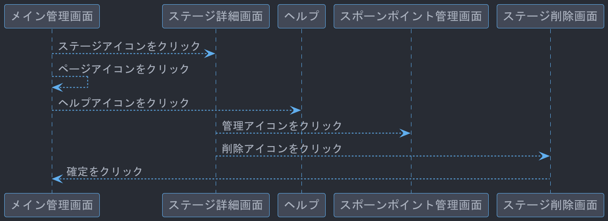
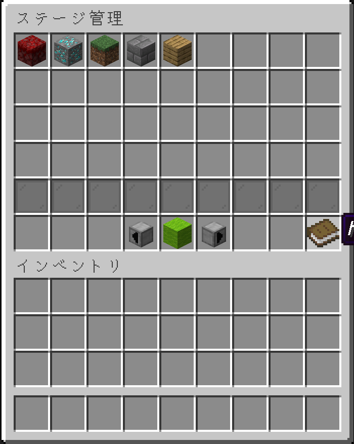
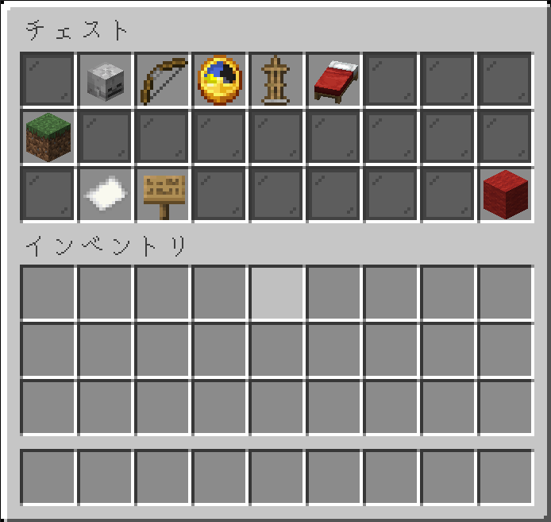
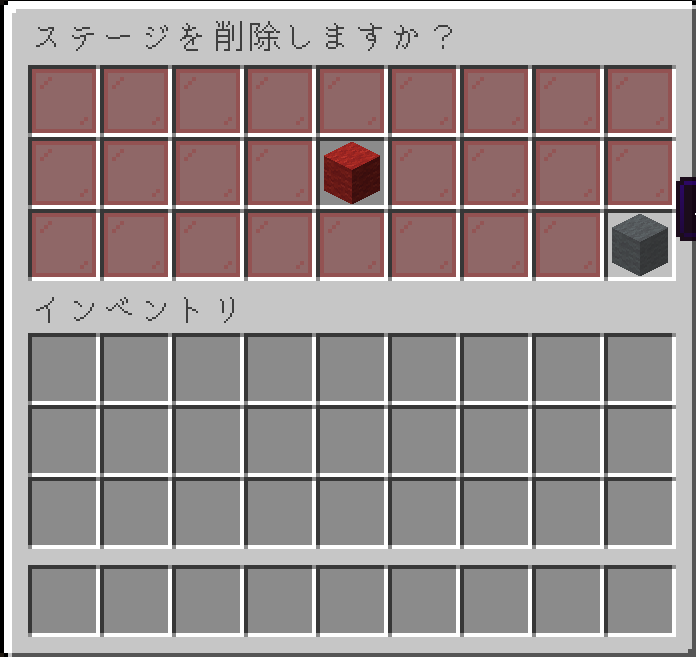
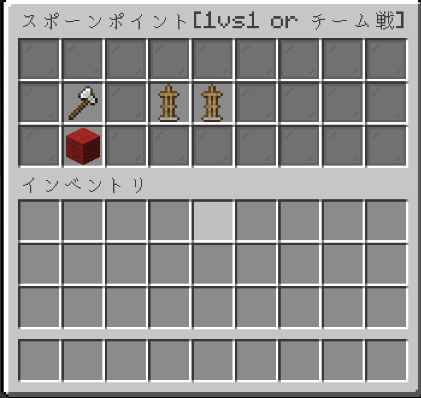
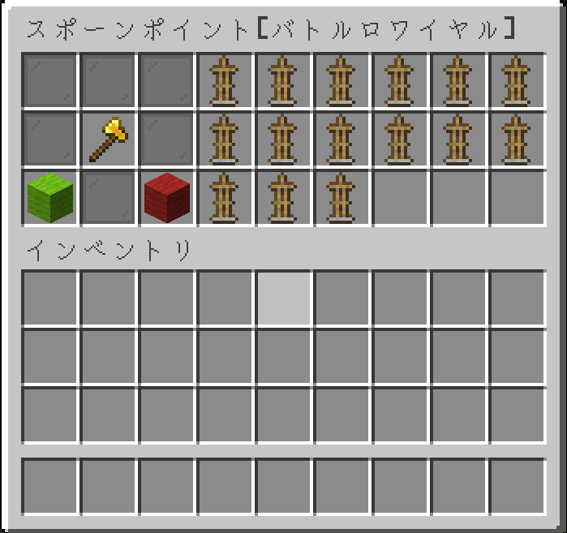

# ステージ管理画面

## 画面一覧
- [メイン管理画面](#メイン管理画面)
- [ステージ詳細画面](#ステージ詳細画面)
- [ステージ削除確認画面](#ステージ削除確認画面)
- [スポーンポイント管理画面](#スポーンポイント管理画面)

## 画面遷移

## メイン管理画面

- ステージ情報が埋め込まれているブロックを表示
- 下から2行目(インデックス番号:`36`~`44`)は灰色の色付きガラス板(`Material.GRAY_STAINED_GLASS_PANE`)
- 最下段の中心(インデックス番号:`49`)は黄緑色の羊毛(`Material.LIME_WOOL`)でステージ追加のボタン
- 最下段の左右(インデックス番号:`48`,`50`)はカスタムヘッドでページ移動のボタン
- 本(`Material.BOOK`)はヘルプのボタン
> カスタムヘッドURL
> - →
> http://textures.minecraft.net/texture/8e403cc7bbac73670bd543f6b0955bae7b8e9123d83bd760f6204c5afd8be7e1
> - ←
> http://textures.minecraft.net/texture/533ad5c22db16435daad61590aba51d9379142dd556d6c422a7110ca3abea50

## ステージ詳細画面

### アイコンの詳細

| ブロック    | 詳細               |
|---------|------------------|
| 草ブロック   | ステージアイコンとステージ名表示 |
| スケルトンの頭 | プレイヤーの参加状況       |
| 弓       | ゲームモードの変更        |
| 時計      | 制限時間の変更          |
| アマスタ    | 最小・最大人数の変更       |
| ベッド     | スポーンポイントの管理      |
| 紙       | ステージUUIDのコピー     |
| 看板      | ステージへの参加看板の再取得用  |
| 赤色の羊毛   | ステージの削除          |

- インベントリのタイトルは`ステージ名`
- ゲームモードはクリックで切り替える
- 参加状況はプレイヤーがいるとスティーブの頭にする
- ステージUUIDのコピーの挙動はURL踏んだ時と同じ処理orチャット欄補間

## ステージ削除確認画面

## スポーンポイント管理画面

## スポーンポイント管理画面(バトロワ)

