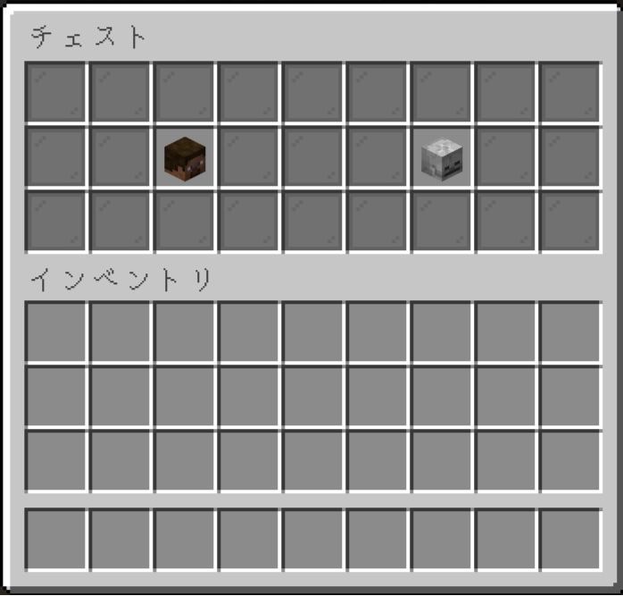
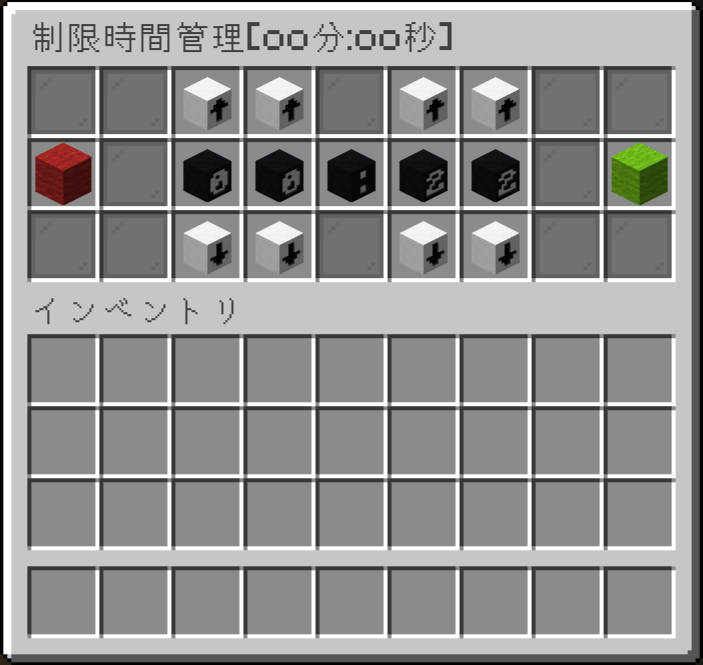
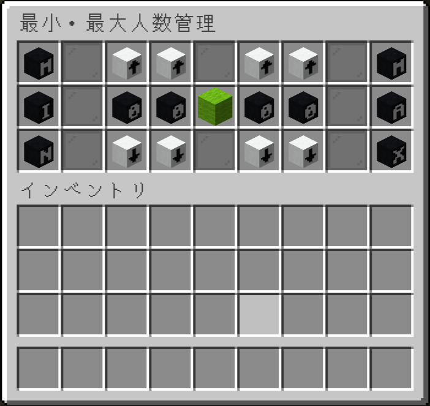

# ステージ管理画面

## 画面一覧
- [メイン管理画面](#メイン管理画面)
- [ステージ詳細画面](#ステージ詳細画面)
- [ステージ削除確認画面](#ステージ削除確認画面)
- [スポーンポイント管理画面](#スポーンポイント管理画面)

## 画面遷移

## メイン管理画面

- ステージ情報が埋め込まれているブロックを表示
- 下から2行目(インデックス番号:`36`~`44`)は灰色の色付きガラス板(`Material.GRAY_STAINED_GLASS_PANE`)
- 最下段の中心(インデックス番号:`49`)は黄緑色の羊毛(`Material.LIME_WOOL`)でステージ追加のボタン
- 最下段の左右(インデックス番号:`48`,`50`)はカスタムヘッドでページ移動のボタン
- 本(`Material.BOOK`)はヘルプのボタン
> カスタムヘッドURL
> - →
> http://textures.minecraft.net/texture/8e403cc7bbac73670bd543f6b0955bae7b8e9123d83bd760f6204c5afd8be7e1
> - ←
> http://textures.minecraft.net/texture/533ad5c22db16435daad61590aba51d9379142dd556d6c422a7110ca3abea50

## ステージ詳細画面

### アイコンの詳細

| ブロック    | 詳細               |
|---------|------------------|
| 草ブロック   | ステージアイコンとステージ名表示 |
| スケルトンの頭 | プレイヤーの参加状況       |
| 弓       | ゲームモードの変更        |
| 時計      | 制限時間の変更          |
| アマスタ    | 最小・最大人数の変更       |
| ベッド     | スポーンポイントの管理      |
| 紙       | ステージUUIDのコピー     |
| 看板      | ステージへの参加看板の再取得用  |
| 赤色の羊毛   | ステージの削除          |

- インベントリのタイトルは`ステージ名`
- ゲームモードはクリックで切り替える
- 切り替えのデザインはアイテム名(アイコンは弓のまま)
- 参加状況アイコンは常にスティーブの頭へ
- ステージUUIDのコピーの挙動はURL踏んだ時と同じ処理orチャット欄補間
- 制限時間・人数の変更結果は、ステージ詳細管理画面のアイテムアイコンのアイテム名に適用してください。

## ステージ削除確認画面

- 赤色の羊毛->アイテム名「削除」`Color.RED`■
- 灰色の羊毛->アイテム名「キャンセル」`Color.Gray`■

## スポーンポイント管理画面

## スポーンポイント管理画面(バトロワ)

## 参加人数状況オブザーバー画面

- スティーブの頭->アイテム名「参加」`Color.GREEN`■
- スケルトンの頭->アイテム名「観戦」`Color.AQUA`■
- 参加・観戦の挙動は、看板からの参加と同じ

## 制限時間管理画面

- 赤色の羊毛->アイテム名「リセット」`Color.RED`■
- 黄緑色の羊毛->アイテム名「確定」`Color.GREEN`■
- 表記は00分:00秒
- 黒い数字と:のカスタムヘッド
- https://minecraft-heads.com/custom-heads/alphabet?page=4
- 「↑」白色
- https://minecraft-heads.com/custom-heads/head/9220-white-arrow-up
- 「↓」白色
- https://minecraft-heads.com/custom-heads/head/9227-white-arrow-down

## 最小・最大人数管理画面

- 左が最小！
- 右が最大！！
- 黄緑色の羊毛->アイテム名「確定」`Color.GREEN`■
- 「M」
- https://minecraft-heads.com/custom-heads/head/8828-black-m
- 「I」
- https://minecraft-heads.com/custom-heads/head/8832-black-i
- 「N」
- https://minecraft-heads.com/custom-heads/head/8827-black-n
- 「A」
- https://minecraft-heads.com/custom-heads/head/8840-black-a
- 「X」
- https://minecraft-heads.com/custom-heads/head/8817-black-x
